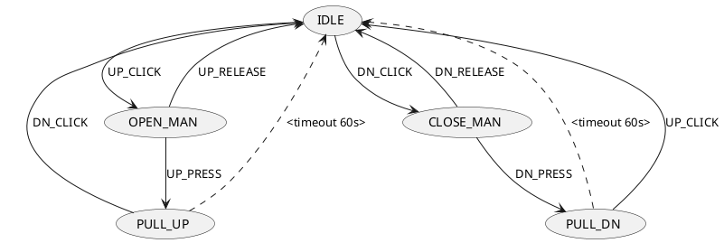
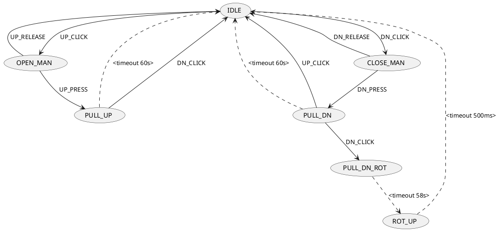

# Projekt na automatizované ovládání žaluzií

## Instalace `ubuntu`
* download latest `arduino ide`
** `./install.sh`
** `./arduino-linux-setup.sh <<username>>` - zajištění přístupu na programování

## Různé

Čas arduina jde o 20% pomaleji. Takže je třeba timeouty nastavovat na 80% proti žádanému. Možná jde úplně jinak... To se ještě musí šéfnout.

### Implementace na Adruino UNO (5 žaluzií = 1 patro)
Sady pinů:
	* ANALOG IN - 6 (dájí se plně použít jako digitální včetně pull up rezistoru)
	* Digital PWN - 8 + 6

Plánované použití:
	* výstup: digital 0 - 9 (8 + 2)
	* vstup: analog (6ks) + digital (9-13 ... 4 ks)
		... použijí se pull up rezistory

### Zapojení dolní patro

[piny arduino uno](https://www.arduino.cc/en/Hacking/PinMapping168)

IN_OBYVAK(6) ... UP_LEFT, DOWN_LEFT, UP_RIGHT, DOWN_RIGHT, UP_TERAS, DOWN_TERAS
OUT_OBYVAT(6)
IN_PRAC(2)  ... UP, DOWN
OUT_PRAC(2)

PATICE 0-7 (8)  : IN_OBYV(6), IN_PRAC(2)
PATICE 8-13 (6) piny 8-9 : OUT_PRAC(2)
PATICE A0-A5 :   OUT_OBYV(6)

PATICE 0-7:   2,3,4,5,6,11,12,13
PATICE 8-13:  14,15,16,17,18,19
PATICE A0-A5: 23,24,25,26,27,28 

### Zapojeni horní patro

IN_POKOJ_VYCHOD(4) ... UP_VYCHOD, DOWN_VYCHOD, UP_JIH, DOWN_JIH
OUT_POKOJ_VYCHOD(4)
IN_POKOJ_ZAPAD(4) ... UP_JIH, DOWN_JIH, UP_ZAPAD, DOWN_ZAPAD
OUT_POKOJ_ZAPAD
IN_KOUPELNA(2) ... UP, DOWN
OUT_KOUPELNA

PATICE 0-7 (8)  : IN_POKOJ_VYCHOD, IN_POKOJ_ZAPAD
PATICE 8-13 (6) : piny 8-9: IN_KOUPELNA, piny 10-13: OUT_POKOJ_VYCHOD
PATICE A0-A5(6) : piny 0-3: OUT_POKOJ_ZAPAD, piny 4-5: OUT_KOUPELNA

## Realizovaný stavový automat

OPEN = UP direction
CLOSE = DOWN direction

Požadovaná úprava:

