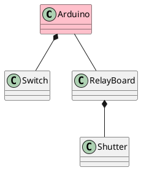
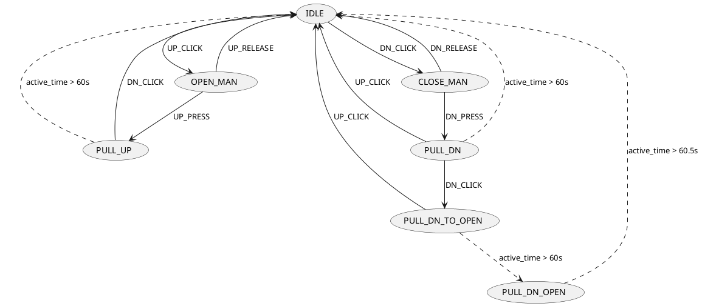
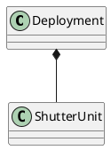

# Smart shutter control 

## About

Firmware for [Arduino](https://www.arduino.cc/) interconecting switch and shutter using relay board according to scheme

The control logic is set by user defined [state machine](https://en.wikipedia.org/wiki/Finite-state_machine) so it can be easily changed.

## Using on `ubuntu 20.04`
* install `arduino ide` using `Synaptic`
* on directory `shutter_unit` process `compress to zip`, file  `shutter_unit.zip` is created
* run `arduino ide`
* add `/library/shutter_unit` to `arduino ide`
  * `Sketch -> Import Library -> Add Library` select `shutter_unit.zip`
* open `/zaluzie_*np/zaluzie_*np.ino`
* compile and upload to Arduino Uno
* for tests on PC use folder `zaluzie_pc`

## Implemented state diagram

OPEN = UP direction
CLOSE = DOWN direction

## Class diagram

## Deployment 

Deployment examples - authors house.

#### zaluzie_1np (Arduino - zapojení dolní patro)

[arduino uno pins](https://www.arduino.cc/en/Hacking/PinMapping168)

* IN_OBYVAK(6) ... UP_LEFT, DOWN_LEFT, UP_RIGHT, DOWN_RIGHT, UP_TERAS, DOWN_TERAS
* OUT_OBYVAT(6)
* IN_PRAC(2)  ... UP, DOWN
* OUT_PRAC(2)
* 
* PATICE 0-7 (8)  : IN_OBYV(6), IN_PRAC(2)
* PATICE 8-13 (6) piny 8-9 : OUT_PRAC(2)
* PATICE A0-A5 :   OUT_OBYV(6)
* 
* PATICE 0-7:   2,3,4,5,6,11,12,13
* PATICE 8-13:  14,15,16,17,18,19
* PATICE A0-A5: 23,24,25,26,27,28 

### zaluzie_2np (Arduino - zapojeni horní patro)

* IN_POKOJ_VYCHOD(4) ... UP_VYCHOD, DOWN_VYCHOD, UP_JIH, DOWN_JIH
* OUT_POKOJ_VYCHOD(4)
* IN_POKOJ_ZAPAD(4) ... UP_JIH, DOWN_JIH, UP_ZAPAD, DOWN_ZAPAD
* OUT_POKOJ_ZAPAD
* IN_KOUPELNA(2) ... UP, DOWN
* OUT_KOUPELNA
*
* PATICE 0-7 (8)  : IN_POKOJ_VYCHOD, IN_POKOJ_ZAPAD
* PATICE 8-13 (6) : piny 8-9: IN_KOUPELNA, piny 10-13: OUT_POKOJ_VYCHOD
* PATICE A0-A5(6) : piny 0-3: OUT_POKOJ_ZAPAD, piny 4-5: OUT_KOUPELNA

### zaluzie_pc (PC)